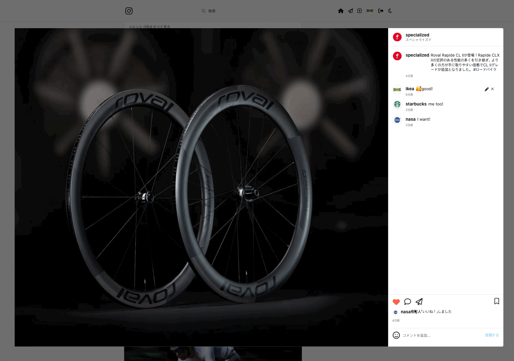

  <a href="https://instagram-rspsang.netlify.app">
    
      
    <a display="block" href="https://instagram-rspsang.netlify.app">https://instagram-rspsang.netlify.app</a>
      
    
  </a>

## Built with

### Front-end

- `React`
- `Typescript`
- `Apollo Client`
- `Styled Components`
- `GraphQL Code Generator`

### Back-end

- `NodeJS`
- `Express`
- `Apollo Server`
- `GraphQL`
- `PostgreSQL`
- `Prisma`
- `JsonWebToken`

### Deploy

- `Netlify`
- `Heroku`
- `AWS S3`

## Project

> 1. 会員登録, ログイン, ログアウト

- ユーザーはメールアドレス、苗字、名前、ユーザーネーム、パスワどを入力して会員登録することができます。
- 会員登録時、入力したパスワードは`Bcrypt`を利用してハッシュ化され、アカウント情報は`PostgreSQL`に保存されます。
- ユーザーはユーザーネーム、パスワードを利用してログインすることができます。
- ログインに成功した場合、`JsonWebToken`からもらってトークンをローカルストレージに保存します。
- `Apollo Client`の`Reactive variables`を利用して local state をアップデートします。
- `Reactive variables`を変更することによって該当変数に依存する全てのクエリのアップデートが行われます。
- ログアウトの場合`Reactive variables`を変更し、ローカルストレージに保存されたトークンとストアに保存されたデータを消去します。
    
  

> 2. プロフィール

- プロフィールページからユーザー情報、写真、フォロー、フォロワーを確認することができます。
    
  

> 3. ユーザーフォロー、フォローの取り消し

- ユーザーをフォローまたはフォローを取り消すことができます。
- フォローやフォローの取り消しをすると`Apollo Client`を利用して相手と自分のキャッシュフィールド値を直接修正し、それぞれのリストをアップデートします。
- ユーザーをフォロするとホーム画面から該当ユーザーがアップロードした写真を見ることができます。
    
  

> 4. ユーザー及びハッシュタグ検索

- **@ユーザーネーム** でユーザーを検索することができます。
- **#ハッシュタグ** でハッシュタグを検索することができます。
- `React Hook Form`を利用し **@ユーザーネーム** を入力した際にはユーザーを検索し **#ハッシュタグ**を入力した際にはハッシュタグを検索します。
    
  

> 5. 写真

- 写真をクリックして写真の詳細情報を確認することができます。
- 写真をアップロードしたユーザー、キャプション、コメント、いいねなどを確認することができます。
- 写真にいいねを押したユーザーを確認することができ、該当ユーザーをフォロー、フォローの取り消しをすることができます。
- 写真にコメント作成、修正、削除することができます。
- 写真をアップロードしたユーザーは写真キャプションの修正と写真の削除をすることができます。
    
  

> 6. 写真アップロード

- 写真イメージファイルとキャプションを入力して写真をアップロードすることができます。
- キャプションには **#ハッシュタグ** を入力してハッシュタくを作成することができます。
- アップロードした写真は `AWS S3`のバケットに保存されます。
    
  

> 7. 写真いいね、いいね取り消し

- 写真にいいねまたはいいね取り消しができます。
- いいねまたはいいね取り消しをすると、`Apollo Client`を利用して該当写真のキャッシュフィールド値を直接修正しいいねと全体いいね数をアップデートします。
    
  

> 8. ハッシュタグ

- ハッシュタグは該当ハッシュタグが持っている全体写真を呼び出します。
- 写真アップロードの際に、キャプションに **#ハッシュタグ** を入力すると新しいハッシュタグが生成されます。
    
  

> 9. ダークモード

- 日と月のアイコンをクリックしライトモードとダークモードを切り替えることができます。
- `Styled Components`の `ThemeProvider`を利用してライトテーマとダークテーマを設定します。
- ダークモード切り替えの際ダークモード活性値をローカルストレージに保存して`Apollo Client`の `Reactive variables`を利用してlocal stateをアップデートします。
    
  

> 10. その他

- `Front-end`は `Netlify`に, `Back-end`は `Heroku`にデプロイしています。
- `Database`は `Heroku PostgreSQL`にデプロイしています。
- `GraphQL Code Generator`を利用して `GraphQL Schema`によりタイプとコードを生成しました。
- `Front-end`: https://github.com/RspSang/instaclone-front
- `Back-end`: https://github.com/RspSang/instaclone-backend

## License

MIT
